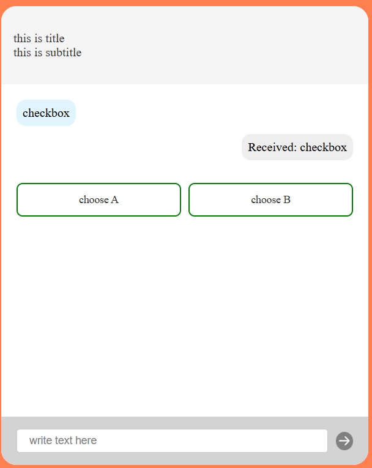

# Chat Widget Example

## example to use [@mgvts/chat-widget](https://www.npmjs.com/package/@mgvts/chat-widget)

### With Vue 3

```vue
<script>
import { ChatWidget } from "@mgvts/chat-widget";

import '@mgvts/chat-widget/dist/style.css'
</script>

<template>
  <ChatWidget :config="config" class="override-props" />
</template>
```
config is a [ChatConfig](https://github.com/mgvts/chat-widget/blob/main/src/types/ChatConfig.ts) object
example of config is in [src/devConfig.ts](https://github.com/mgvts/chat-widget/blob/main/examples/src/devConfig.ts)

```typescript
import type { ChatConfig } from '@mgvts/chat-widget'

export const config: ChatConfig = {
    uiTexts:  {
        title: 'this is title',
        subtitle: 'this is subtitle',
        inputTitle: 'here is input title',
        placeholder: 'write text here',
    },
    messageHandlers: {
        existOptions: true,
        userMessageShow: (data: { message: string}) => {
            return data.message
        },
        botMessageShow: (data: { content: string }) => {
            return data.content
        },
        optionMessageShow: (data: {options: object}) => {
            const optionsMap = data.options
            if (!optionsMap) return null
            if ('radio' in optionsMap) {
                return {radio: optionsMap.radio}
            } else if ('checkbox' in optionsMap) {
                return {checkbox: optionsMap.checkbox}
            }else {
                return null
            }
        }
    },
    host: {
        url: "example.com",
        method: "POST",
        headers: {
            'Content-Type': 'application/json'
        },
        processRequest: (data) => ({
            message: data.message
        }),
        processResponse: (response) => response
    }
}
```

exampoles output from [server](https://github.com/mgvts/chatWidgetExampleServer):
```json
{
    "content": "Получено: radio",
    "timestamp": "2024-11-05T11:29:22.328Z",
    "options": {
        "radio": [
            "answer 1",
            "answer 2"
        ]
    }
}
```

```json
{
    "content": "Получено: checkbox",
    "timestamp": "2024-11-05T11:29:33.297Z",
    "options": {
        "checkbox": [
            "choose A",
            "choose B"
        ]
    }
}
```


data saves in localStorage [chatHistory], so when you reload the page, the history will not be lost


styles are in [style.css](https://github.com/mgvts/chat-widget/blob/main/dist/style.css)
and actually you can override them example 
```vue
<template>
  <div>
    <ChatWidget :config="config" class="chat-config">
      <template v-slot:header>
        
        <div class="d-flex align-items-center justify-center w-100">
          <div>
            Hello in chat from slot header
          </div>
        </div>
      </template>
    </ChatWidget>
  </div>
</template>

<style scoped>
.chat-config {
  --chat-z-index: 9999;

  --chat-icon-bg: #FF0000;
  --chat-icon-color: white;


  --chat-header-height: 85px;
  --chat-header-padding: 0 40px;
  --chat-header-bg-color: white;

  --chat-header-text-color: black;

  --chat-font-family: "Sans Serif";

  --chat-user-message-bg-color: white;
  --chat-bot-message-bg-color: #e0e0e0;
  --chat-messages-gap: 20px;


  --chat-input-container-bg-color: #e0e0e0;
  --chat-send-disabled-bg-color: #e0e0e0;
  --chat-send-bg-color: #FF0000;

  --chat-option-border-color: #FF0000;
  --chat-option-hover-bg-color: #e0e0e0;
  --chat-option-hover-border-color: #FF0000;
  --chat-option-selected-bg-color: #FF0000;
  --chat-option-selected-border-color: #FF0000;
  --chat-option-selected-text-color: white;
}
</style>
```

